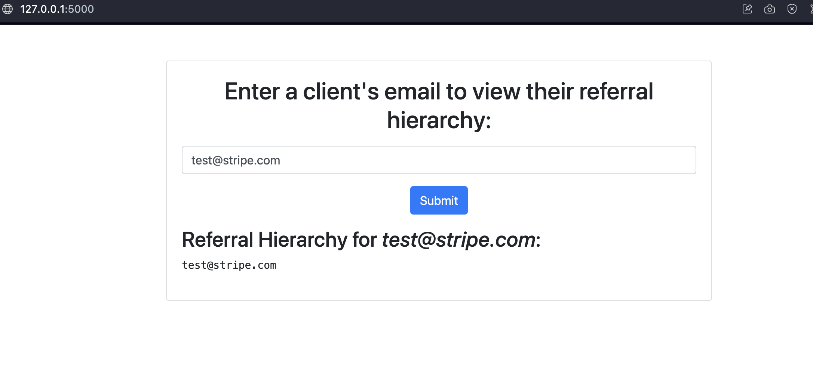
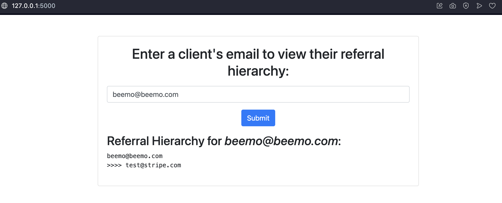
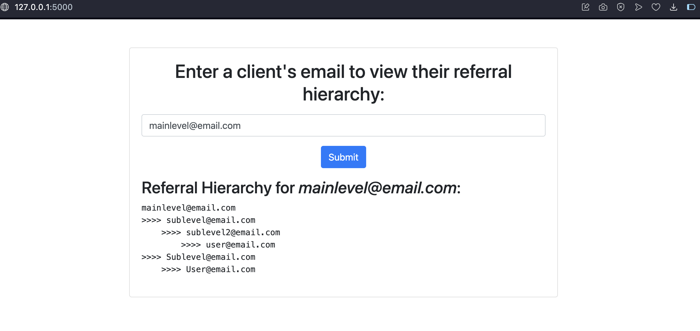
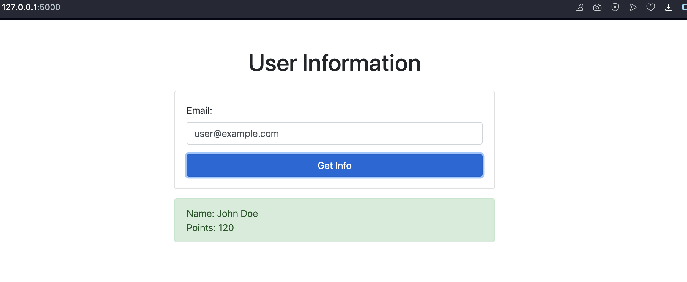
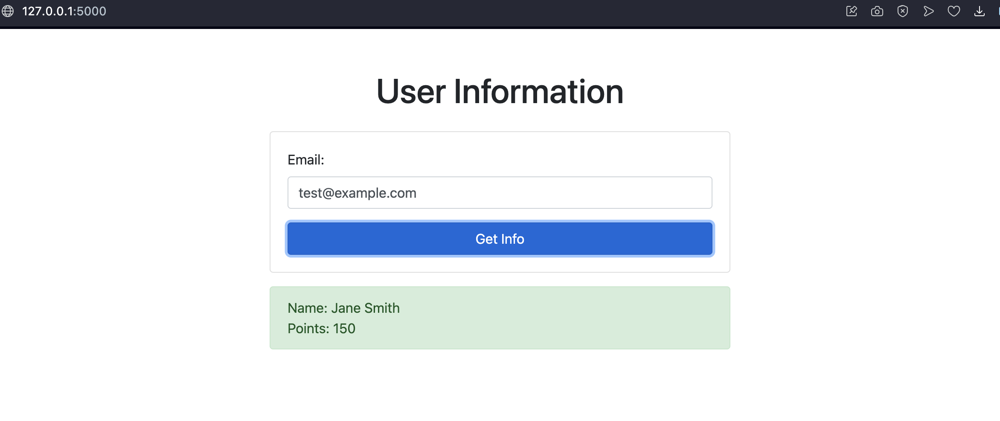

# Flask Email Info API and Client

This project consists of two separate Flask applications: Task1 and Task2.
Each application has its own functionality and runs independently from one another.

## Installation

Before you can run the Flask applications, you need to install the required Python packages. This project uses `pip` for package management.

### Prerequisites

- Python 3
- pip
- Virtual environment (recommended)

### Setup

It is recommended to use a virtual environment to keep dependencies required by different projects separate and to prevent conflicts. To create and activate a virtual environment, you can use the following commands:

#### For Unix/macOS:

```sh
# Navigate to the project directory
cd AlphaMasterClass_Test

# Create a virtual environment
python3 -m venv venv

# Activate the virtual environment
source venv/bin/activate
```

#### For Unix/macOS:

```sh
# Navigate to the project directory
cd AlphaMasterClass_Test

# Create a virtual environment
python3 -m venv venv

# Activate the virtual environment
source venv/bin/activate
```

### Installing Dependencies

With the virtual environment activated, install the project dependencies using:
```sh
cd AlphaMasterClass_Test
pip install -r requirements.txt
```

## Task 1

#### Task Description:
"Our clients can refer their friends to join any of our events. They would share their
email to identify the referral relationship.

Task: Use Flask to display the referral relationship for all clients under the main
referrer. Implement a basic UI that is user friendly.

Optional: Implementing a  database."

A mock data set is provided in `client.csv`

### Running Task 1

Navigate to the Task1 directory and run the following command to start the Flask server:

```sh
cd Task1
flask run
```
Then click the provided url address to see the result

Each application will be accessible at http://localhost:5000 by default.

### Task 1 Screenshots:





## Task 2

#### Task Description:
"Task: Build a simple API on Flask that accepts a POST request given an email
address. Then, create a basic web page that uses JavaScript to create a POST
request to retrieve the name and points given an email."

Sample Table:

| email | name | points |
|-------|------|--------|
| string| String | int    |

### Running Task 2

Navigate to the Task2 directory and run the following command to start the Flask server:

```sh
cd Task2
flask run
```

Then click the provided url address to see the result

Each application will be accessible at http://localhost:5000 by default.

#### Sample data to test:

| Email             | Name       | Points |
|-------------------|------------|--------|
| user@example.com  | John Doe   | 120    |
| test@example.com  | Jane Smith | 150    |


### Task 1 Screenshots:



